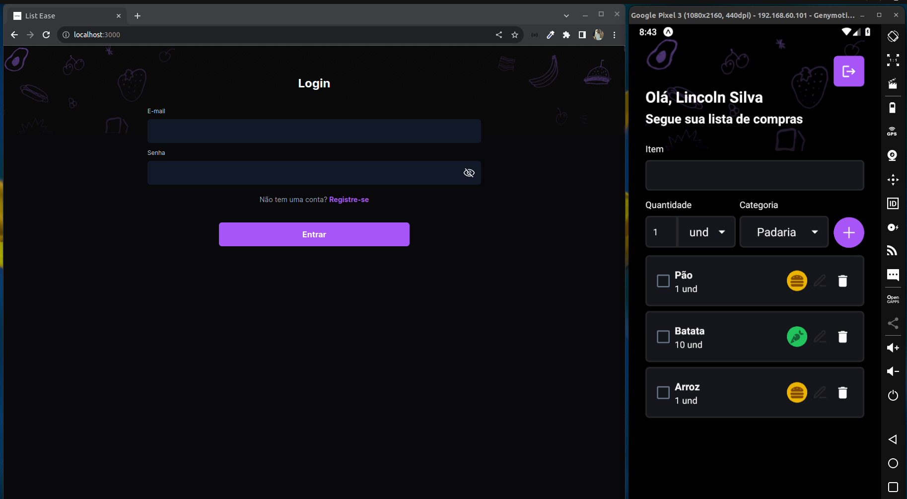

  <h1>List Ease</h1>

  <a href="#-projeto">Projeto</a>&nbsp;&nbsp;&nbsp;|&nbsp;&nbsp;&nbsp;
  <a href="#-tecnologias">Tecnologias</a>&nbsp;&nbsp;&nbsp;|&nbsp;&nbsp;&nbsp;
  <a href="#-layout">Layout</a>&nbsp;&nbsp;&nbsp;|&nbsp;&nbsp;&nbsp;
  <a href="#-instalacao">Instalação</a>

 

  

## 💻 Projeto

O List Ease é uma aplicação criada como parte do desafio 34 do BoraCodar, proposto pela Rocketseat. Seu principal objetivo é fornecer um sistema de gerenciamento de checklist, disponível tanto na versão web quanto mobile, que permite o registro de itens de compras. Inicialmente, o desafio era focado no desenvolvimento da interface frontend web da aplicação. No entanto, o projeto foi aprimorado ao longo do tempo, incorporando um backend personalizado com um banco de dados e uma interface frontend mobile. 

## 🚀 Tecnologias

Esse projeto foi desenvolvido com as seguintes tecnologias:

- Typescript
- Express
- Socket IO
- Json Web Token
- Zod
- Prisma
- Postgresql
- Docker
- NextJs
- React Hook Form
- Tailwindcss
- Axios
- Expo
- React Native
- Native Wind

## 🔖 Layout

No link abaixo você encontra o layout do projeto. Lembrando que você precisa ter uma conta no [Figma](http://figma.com/) para acessá-lo.

- [Layout](<https://www.figma.com/file/tFlqN13tM1qQcC037kELBC/Lista-de-Compras-%E2%80%A2-Desafio-34>)

## Instalação

- Api
  - Ambiente NodeJs configurado
  - Ambiente Docker e Docker compose configurado
  - Clonar o repositório
  - Instalar as dependencias com (yarn ou npm)
  - Arquivo .env configurado      
  - Ambiente Postgresql configurado, rodar o comando (yarn prisma:migrate-deploy)
  - Rodar o comando (docker compose up)
- Web
  - Ambiente NodeJs configurado
  - Instalar as dependencias com (yarn ou npm)
  - Arquivo .env configurado
  - Rodar o comando (yarn dev)
- Mobile
  - Ambiente NodeJs configurado
  - Ambiente do emulador do android configurado ou expo go pelo próprio celular
  - Instalar as dependencias com (yarn ou npm)
  - Arquivo .env configurado
  - Rodar o comando (yarn start)

## Demo do aplicativo

- Instale o expo go no seu celular e leia o QRCode

---

Feito com ♥ by Lincoln silva

- [Instagram](https://www.instagram.com/jotalincoln/)
- [Github](https://github.com/LincolnSA)
- [Portfólio](https://lincolnsa.github.io/)